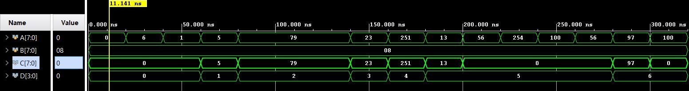

<h1>PrimeNoDet</h1>

<h2>Introduction</h2>

This is a prime number detection module. Among the inputs provided to the module, if an input is a prime number, it is passed on to one of the outputs.

<h2>Working</h2>

A and B are inputs to the module. A accepts the number to be tested. B accepts the maximum number of primes to be checked for.
C and D are outputs of the module. C produces the number if its detected as a prime number, else outputs 0. D is a counter that is incremented everytime a prime number is detected.

<h2>Simulation</h2>

